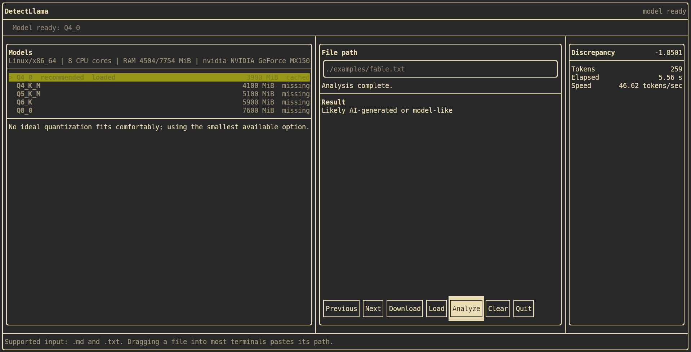

# DetectLlama

DetectLlama is a local TUI application for checking whether a text looks human-written or AI-generated.
It uses [llama.cpp](https://github.com/ggml-org/llama.cpp) and a Falcon 7B GGUF model, so the full workflow can run on
your own device without sending the text to an external API.

The goal is simple: open DetectLlama, let it choose the best model quantization for your machine, download it if needed,
then paste text directly or analyze a local `.txt`/`.md` file.

<p align="center">
  
</p>

## Why DetectLlama?

- **Local by default**: input files stay on your machine.
- **Hardware-aware setup**: DetectLlama profiles RAM, disk, CPU, NVIDIA VRAM, or Apple unified memory.
- **Automatic model recommendation**: the TUI highlights the Falcon 7B quantization that best fits the detected device.
- **One-screen workflow**: model selection, llama.cpp cache discovery, download, loading, and analysis happen inside the
  terminal UI.
- **Anonymous public downloads**: missing public GGUF models are downloaded directly from Hugging Face without passing
  tokens.

## Quick Start

Required:

- CMake 3.15+
- a C++20 compiler (`g++`, `clang++`, or MSVC)
- Git

Build DetectLlama:

```bash
./scripts/build.sh
```

Run the TUI:

```bash
./scripts/run.sh
```

DetectLlama opens immediately in fullscreen mode. If the recommended model is already cached in the llama.cpp cache, it
loads it. If not, type `/models`, choose a quantization, and press Enter to download and load it.

After the model is ready, use the prompt field:

- type `/` to open the command dropdown
- enter `/models` to open the model picker
- enter `/path ./file.txt` to analyze a local `.txt` or `.md` file
- paste text directly to detect it without creating a file first

Most terminals implement drag and drop by pasting the file path; DetectLlama still normalizes quoted paths, escaped spaces,
and `file://` URIs.

## What The TUI Shows

- the recommended quantization for your device
- all available Falcon 7B GGUF variants
- extra local `.gguf` files already present in the llama.cpp cache
- whether each catalog model is already cached or missing
- model selection and download through `/models`
- analysis status while inference is running
- AI probability estimate, discrepancy score, token count, elapsed time, and tokens/sec in the right sidebar

## Model Selection

DetectLlama targets about `30 tokens/sec` by default. The selector uses a conservative memory budget and checks:

- available disk space in the llama.cpp model cache
- total and available system RAM
- NVIDIA VRAM when `nvidia-smi` is available
- Apple Silicon unified memory on macOS
- CPU core count and OS/architecture

If only CPU is usable, DetectLlama falls back to the smallest practical quantization and warns that 30 tokens/sec may be
unlikely.

You can inspect the launch command without opening the app:

```bash
DETECT_LLAMA_DRY_RUN=1 ./scripts/run.sh
```

Optional advanced commands:

```bash
./scripts/build.sh --gpu cuda --jobs 8
./scripts/build.sh --gpu cpu
```

DetectLlama uses the same model cache convention as llama.cpp. By default this is `~/Library/Caches/llama.cpp` on macOS,
`$XDG_CACHE_HOME/llama.cpp` on Linux when set, or `~/.cache/llama.cpp` otherwise. Set `LLAMA_CACHE=/path/to/cache` to
override it. Downloaded catalog models are written there, and the TUI lists any complete `.gguf` already found in that
cache.

DetectLlama intentionally does not use Hugging Face tokens. Model downloads are anonymous and only support public,
ungated Hugging Face repos.

## Understanding The Score

DetectLlama reports a discrepancy score. Higher scores mean the text looks more human-written to the scoring model.
Lower scores mean it looks more model-like or AI-generated. Scores near zero are ambiguous and should be interpreted with
a calibrated threshold for the dataset you care about.

## How The Algorithm Works

DetectLlama follows the analytic Fast-DetectGPT approach. The original
[Fast-DetectGPT paper](https://arxiv.org/abs/2310.05130) shows how to estimate whether text sits in high-curvature
regions of a language model probability surface. AI-generated text often follows high-probability model patterns more
closely, and this can be measured without generating many perturbed samples.

The core metric is Conditional Probability Curvature:

$$d(x, p_\theta) = \frac{\log p_\theta(x) - \tilde{\mu}}{\tilde{\sigma}}$$

Where:

- $x$ is the original input token
- $\log p_\theta(x)$ is the log likelihood of the original token
- $\tilde{\mu}$ is the expected log likelihood under the model distribution
- $\tilde{\sigma}$ is the standard deviation of those log likelihoods

Unlike DetectGPT-style methods that require extra sampling or perturbation passes, the analytic version evaluates the
model distribution directly. DetectLlama implements this idea with llama.cpp so scoring can run on consumer hardware with
a GGUF model.

<p align="center">
  
</p>

## Credits

- [Fast-DetectGPT](https://arxiv.org/abs/2310.05130) for the analytic detection method.
- [Original Fast-DetectGPT implementation](https://github.com/baoguangsheng/fast-detect-gpt), which uses PyTorch.
- [DetectGPT](https://arxiv.org/abs/2301.11305) for the earlier probability-curvature detection framing.
- [llama.cpp](https://github.com/ggml-org/llama.cpp) for local GGUF inference.
