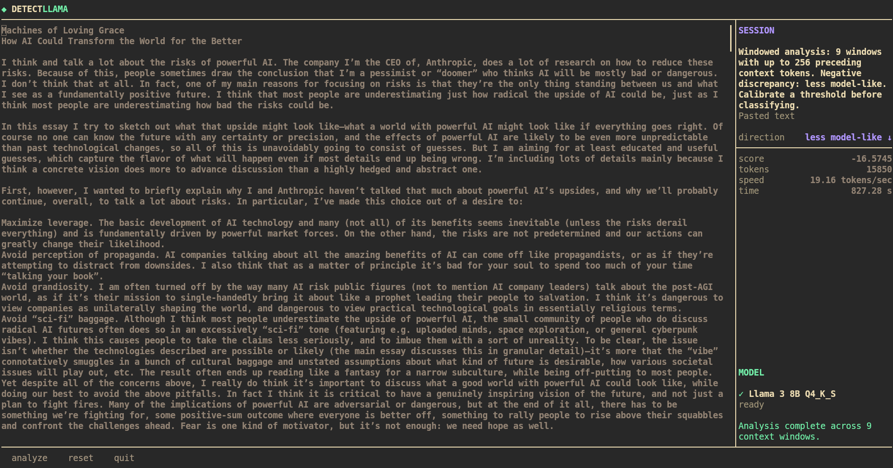

# DetectLlama

DetectLlama is a local TUI that estimates how model-like a passage is using
[llama.cpp](https://github.com/ggml-org/llama.cpp). Text never needs to leave your device.

The detector intentionally supports one configuration only:

- Llama 3 8B base, `Q4_0`
- `Meta-Llama-3-8B.Q4_0.gguf` from `QuantFactory/Meta-Llama-3-8B-GGUF`
- fixed context and batch size of 128 tokens
- calibrated discrepancy threshold `-1.550`

This fixed setup prevents a threshold calibrated for one model or context from being applied to a different one.

<p align="center">
  
</p>

## Quick start

Requirements are CMake 3.15+, a C++20 compiler, Git, and `curl` for the optional model download.

```bash
./build.sh
./run.sh
```

The build uses an installed llama.cpp CMake package when available. Otherwise it can use a local checkout or download
the source:

```bash
./build.sh --llama-path /path/to/llama.cpp
./build.sh --download-llama
```

At startup DetectLlama looks for the exact Q4_0 GGUF in the llama.cpp cache, Hugging Face snapshots, and optional custom
model directories. If it is missing, enter `/download` in the TUI to download about 4.6 GiB anonymously from the public
Hugging Face repository. The application never starts this large download without an explicit command.

TUI commands:

- `/download` downloads and loads the fixed model
- `/path` opens the file modal
- `/path ./file.txt` imports a local `.txt` or `.md` file into the editor
- `/threshold` changes the classification threshold for the current session or resets it to `-1.5500`

Imported files are not analyzed automatically. Review or edit the text, then select `analyze`.

## Model cache

The default llama.cpp cache is `~/Library/Caches/llama.cpp` on macOS,
`$XDG_CACHE_HOME/llama.cpp` on Linux when set, or `~/.cache/llama.cpp` otherwise. `LLAMA_CACHE` overrides the primary
download cache. `DETECT_LLAMA_MODEL_DIRS=/path/one:/path/two` adds recursive search roots, but only the exact supported
Q4_0 filename is accepted.

DetectLlama clears common Hugging Face token environment variables and downloads only from the public, ungated model
repository.

You can inspect the launch command without opening the TUI:

```bash
DETECT_LLAMA_DRY_RUN=1 ./run.sh
```

GPU build and runtime examples:

```bash
./build.sh --gpu cuda --jobs 8
USE_GPU=1 ./run.sh
```

## Headless backend

The build also creates `build/DetectLlamaBackend` for automation. It requires the exact local Q4_0 model path and one
input source:

```bash
build/DetectLlamaBackend \
  --model-path /path/to/Meta-Llama-3-8B.Q4_0.gguf \
  --text "Text to analyze" --json

build/DetectLlamaBackend \
  --model-path /path/to/Meta-Llama-3-8B.Q4_0.gguf \
  --file ./sample.txt --json
```

Context, batch size, model label, and quantization are deliberately not command-line options.

## Understanding the result

DetectLlama implements the analytic Fast-DetectGPT discrepancy statistic. Higher scores are more model-like; lower scores
are less model-like. With the fixed configuration, a score at or above `-1.550` is reported as `AI-like`, while a lower
score is reported as `human-like`.

The `/threshold` modal can override this boundary for the current session. Resetting it restores the calibrated default
of `-1.5500`; changing the threshold does not require running inference again on the current result.

The threshold was calibrated in `notebooks/q4_q8_context_benchmark.ipynb` on the pinned Ghostbuster essay dataset using
human text and AI text from Claude and GPT. It is experimental and dataset-specific: the classification is not proof of
authorship and is not an AI probability.

Short passages are less reliable. DetectLlama reports a low-confidence warning below 50 scored tokens. Texts longer than
128 tokens are processed in overlapping windows; every target token is scored once and the sufficient statistics are
combined before normalization.

The metric is Conditional Probability Curvature:

$$d(x, p_\theta) = \frac{\log p_\theta(x) - \tilde{\mu}}{\tilde{\sigma}}$$

where the numerator compares the observed token log likelihood with its expectation under the model distribution and the
denominator is the corresponding standard deviation.

## Credits

- [Fast-DetectGPT](https://arxiv.org/abs/2310.05130)
- [Original Fast-DetectGPT implementation](https://github.com/baoguangsheng/fast-detect-gpt)
- [DetectGPT](https://arxiv.org/abs/2301.11305)
- [llama.cpp](https://github.com/ggml-org/llama.cpp)
